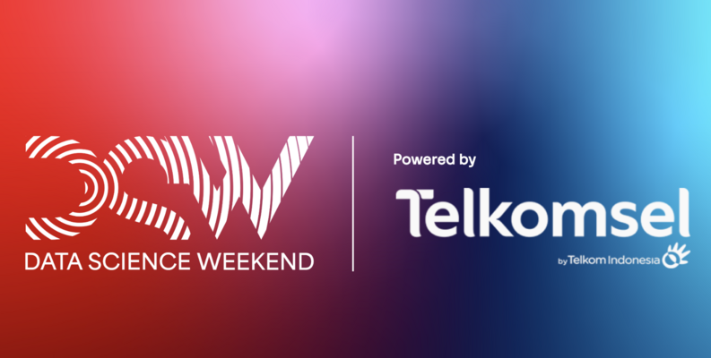

<h1>Data Challenge DSW 2023 - Student &amp; Junior Pro</h1>

	

## Problem Statement

A telecommunication company wants to analyze its customer’s behavior. Given the following dataset, build a solution that aims to provide meaningful insights to the telecommunication company. The solution can be in the form of an AI model, dashboard, or analysis report. If participants plan to build an AI model, participants are free to decide features, labels, and metrics when building the model. You are expected to propose an innovative solution from the dataset.

## Team

Data Jester is a team from State Polytechnic of Malang that consists of 3 members. The team members are:

- Andi Dwi Prastyo
- Mochammad Zaky Zamroni
- Ziedny Bisma Mubarok